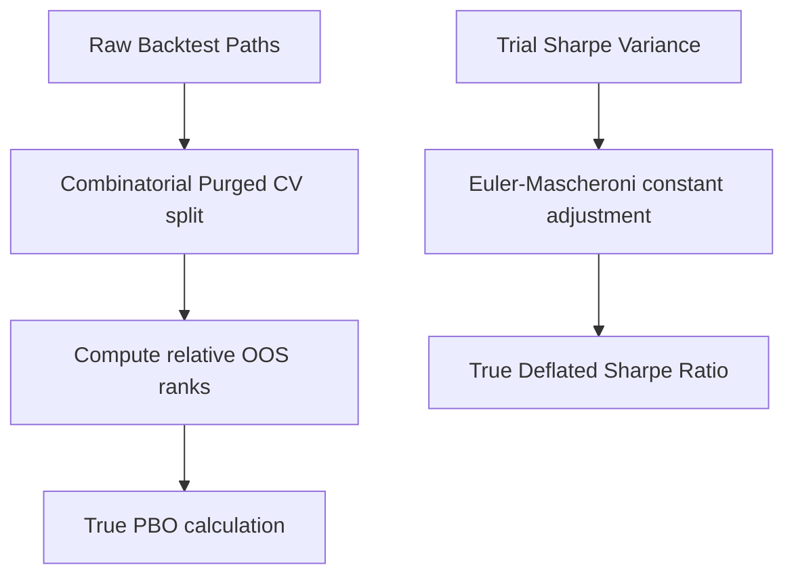

# ADR-003: Scope and Limitations of Simplified Governance Metrics (DSR & PBO)

## Status
Accepted (v6.0-shadow-rc1)

## Context
During the independent quantitative audit of the `validation_engine.py` implementation for NDMP OS v6.0, a structural gap was identified between the production software engineering architecture and the actual mathematical rigor of the statistical validation layer.

Specifically:
1. **Deflated Sharpe Ratio (DSR)**: The current implementation utilizes a simplified benchmark calculation (`math.sqrt(2 * math.log(num_trials)) * 0.1`) as a proxy for the expected maximum Sharpe under the null hypothesis. It lacks finite sample corrections, Euler-Mascheroni constant adjustments, and variance distribution mapping of the trials.
2. **Probability of Backtest Overfitting (PBO)**: The path-splitting calculation uses a simple variance-to-median check across tiled paths rather than running a full Combinatorial Purged Cross-Validation (CPCV) matrix to determine the probability of a strategy outperforming out-of-sample based on relative in-sample ranks.

## Decisions
To maintain the code-freeze integrity of the `v6.0-shadow-rc1` release during the 30-session shadow mode trial, the current simplified metrics will remain active as **governance placeholders**. However, they are formally declared as *simplified indicators* rather than full institutional implementations.

The following gap-analysis and remediation roadmap is frozen for implementation in the **v6.1 Development Cycle**:

### v6.1 Quantitative Remediation Roadmap

1. **True CPCV & PBO Engine**:
   - Replace the tiled returns matrix in `validation_engine.py` with a true partition generator dividing $N$ historical datasets into $K$ combinations, leaving out purged test paths to compute the rank correlation of in-sample vs out-of-sample Sharpe ratios.
2. **True DSR Formula**:
   - Implement the complete Bailey and López de Prado (2014) expected maximum Sharpe estimation:
     $$\text{E}[\max(\text{SR})] = (1 - \gamma) \cdot \text{Z}^{-1}\left[1 - \frac{1}{N}\right] + \gamma \cdot \text{Z}^{-1}\left[1 - \frac{1}{N \cdot e}\right]$$
     where $\gamma$ is the Euler-Mascheroni constant ($\approx 0.5772$) and $\text{Z}$ is the cumulative normal distribution function.
3. **Timezone Standard**:
   - Transition all string-based timestamps to UTC timezone-aware `datetime` objects internally, serializing to string format only at the writing of the final Decision Journals.

## Consequences
- **v6.0-shadow-rc1 Boundary**: The platform is accepted as ready for *controlled shadow-mode validation* but is not approved for *live capital deployment* until the v6.1 mathematical audit is successfully completed.
- **Traceability**: Subsequent weekly reviews will explicitly refer to these metrics as "Simplified DSR Indicators" to prevent false assumptions regarding validation confidence.
